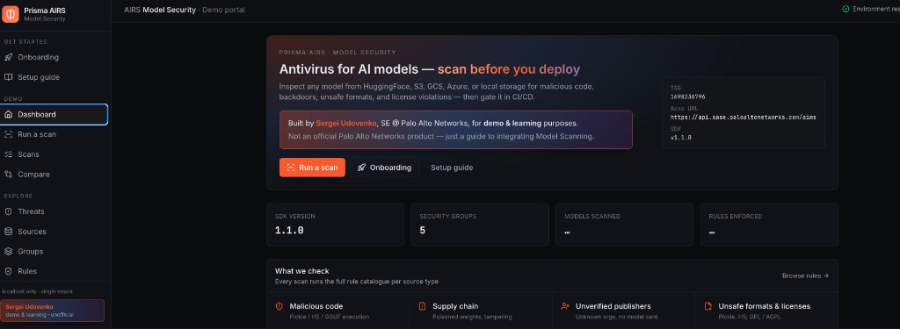

# Prisma AIRS Model Security - Demo & Examples

[](https://opensource.org/licenses/MIT)
[](https://www.python.org/downloads/)

Demonstration repository for scanning machine learning models for security vulnerabilities using Prisma AIRS Model Security.



> **About this project**
> Built by **Sergei Udovenko**, Sales Engineer @ Palo Alto Networks, for **demo and
> learning purposes** — to show how to integrate Prisma AIRS Model Scanning into real
> workflows (SDK, CLI, CI/CD, multiple model sources).
>
> This is **not an official Palo Alto Networks product** and is not affiliated with,
> supported, or endorsed by Palo Alto Networks. It only consumes the proprietary
> `model-security-client` SDK. Use at your own discretion.

## Overview

This repository provides three ways to learn and demo Prisma AIRS Model Security:

1. **Demo portal** (`app/`) — a local full-stack web UI for live demos, customer Q&A, and
   guided enablement (onboarding wizard, threat catalog, FAQ, per-source setup, CI/CD
   generator). See [Demo Portal](#demo-portal-web-ui).
2. **Jupyter notebooks** (`notebooks/`) — interactive, cell-by-cell walkthroughs.
3. **Example scripts** (`examples/`) — minimal copy-paste Python entry points.

All three demonstrate how to:

- Scan models from HuggingFace, S3, GCS, Azure, and local storage for security threats
- Detect malicious code, backdoors, and supply chain attacks
- Integrate model scanning into CI/CD pipelines
- Analyze scan results and take action
- Configure security policies for different model sources

## Demo Portal (Web UI)

The richest way to explore and present Prisma AIRS Model Security. It runs locally, binds
to `127.0.0.1`, and proxies the real SDK so every demo uses live data.

```bash
# After completing Installation below (so .venv + .env exist):
./app/run-app.sh        # builds the frontend on first run, then serves http://localhost:8765
# or, to free the port and restart in one step:
./restart.sh
```

What's inside: live onboarding with environment checks, a printable setup guide, run/compare
scans, browse security groups + rules + scanned models, a CI/CD workflow generator (6
platforms), SDK & CLI snippets, a threat catalog, a customer FAQ, per-source enablement
steps, and an interactive REPL. See [`app/README.md`](app/README.md) for development details.

## Quick Start

> **Important:** The required packages (`model-security-client` and `airs-schemas`) are **proprietary Palo Alto Networks packages** not available on public PyPI. You need Prisma AIRS credentials to access them via a private package repository.

### Prerequisites

Install these before you start:

| Requirement | Needed for | Install |
|-------------|-----------|---------|
| **Python 3.10–3.12** (3.12 recommended; 3.13+ is **not** supported) | Everything | `brew install python@3.12` / `sudo apt install python3.12 python3.12-venv` / `sudo dnf install python3.12` |
| **git** and **curl** | Cloning + authentication | Preinstalled on most systems |
| **jq** | SDK authentication script | Auto-installed by `setup-sdk.sh`, or `brew install jq` / `sudo apt install jq` |
| **Node.js 20+** | Only if you run the Demo Portal web UI | https://nodejs.org (or `nvm install 20`) |
| **Prisma AIRS credentials** | Installing + using the SDK | Service account: Client ID, Client Secret, TSG ID (see [Getting Your Credentials](#getting-your-credentials)) |
| **Outbound network access** | Private SDK install + scanning | Allow `auth.apps.paloaltonetworks.com`, `api.sase.paloaltonetworks.com`, public PyPI, and npm |

### Installation

Copy-paste these steps in order:

```bash
# 1. Clone the repo
git clone https://github.com/sergeiudo/sudo-airs-model-scanning.git
cd sudo-airs-model-scanning

# 2. Add your credentials (get them from https://strata.paloaltonetworks.com)
cp .env.template .env
nano .env   # fill in MODEL_SECURITY_CLIENT_ID, MODEL_SECURITY_CLIENT_SECRET, TSG_ID

# 3. Run automated setup
#    Creates the .venv (auto-selects Python 3.10-3.12), installs base
#    dependencies, authenticates, and installs the proprietary SDK.
./setup-sdk.sh
```

That's it. `setup-sdk.sh` handles the virtual environment, base dependencies, and the private SDK for you — you do **not** need to create `.venv` or run `pip install` manually.

**Then choose how to use it:**

```bash
# Option A — Demo Portal web UI (needs Node.js 20+; builds the frontend on first run)
./app/run-app.sh                 # serves http://localhost:8765

# Option B — Jupyter notebooks
source .venv/bin/activate
jupyter notebook                 # open notebooks/prisma-airs-interactive-model-security.ipynb

# Option C — Example scripts
source .venv/bin/activate
python examples/scan_huggingface_model.py
```

<details>
<summary><strong>Manual installation (advanced)</strong></summary>

If you prefer to manage the environment yourself instead of running `setup-sdk.sh`:

```bash
# Create the virtual environment with a supported Python (3.10-3.12)
python3.12 -m venv .venv
source .venv/bin/activate        # On Windows: .venv\Scripts\activate

# Install base dependencies
pip install -r requirements.txt

# Set credentials as environment variables
export MODEL_SECURITY_CLIENT_ID="AIRS@your-tsg-id.iam.panserviceaccount.com"
export MODEL_SECURITY_CLIENT_SECRET="your-client-secret-uuid"
export TSG_ID="your-tsg-id"

# Get the private PyPI URL and install the SDK
pip install model-security-client --extra-index-url $(./get-pypi-url.sh)
```

</details>

### Deploying at a customer site

This repo is built to be cloned and run on a customer's own workstation or VM for demos/evaluation:

- Use the **customer's own** service-account credentials in `.env` — never share yours. `.env` is git-ignored and is not part of the clone.
- Ensure their firewall/proxy allows the endpoints listed in the prerequisites table.
- The Demo Portal binds to `127.0.0.1` and holds live credentials — keep it on loopback; do not expose it on a public interface.
- A fresh clone contains no `.venv`, `.env`, `node_modules`, or built frontend; `setup-sdk.sh` (and the first `./app/run-app.sh`) generate all of them on-site.

### Getting Your Credentials

1. **Log in to Strata Cloud Manager:** https://strata.paloaltonetworks.com
2. **Create Service Account:**
   - Navigate to: **Settings → Identity & Access → Service Accounts**
   - Click **Add Service Account**
   - Name: `Prisma AIRS Model Security`
   - Role: Select appropriate permissions (minimum: `ai_ms_pypi_auth`, `ai_ms.scans`, `ai_ms.security_groups`)
   - Save and copy the **Client ID** and **Client Secret** (shown once!)
3. **Get TSG ID:**
   - Navigate to: **Tenant Management**
   - Copy your **Tenant Service Group (TSG) ID**

### Run the Jupyter Notebook

```bash
jupyter notebook

# Open: notebooks/prisma-airs-interactive-model-security.ipynb
# Run all cells or step through individually
```

### Run Example Scripts

```bash
# List available security groups
python examples/list_security_groups.py

# Scan HuggingFace models
python examples/scan_huggingface_model.py
```

## Repository Structure

```
sudo-airs-model-scanning/
├── app/                                              # Demo portal (FastAPI + React)
│   ├── backend/                                      # SDK proxy, routes, tests
│   ├── frontend/                                     # React/Vite UI (pages, components)
│   ├── run-app.sh                                    # Build frontend + serve on :8765
│   └── README.md                                     # Portal dev + smoke tests
├── notebooks/
│   ├── prisma-airs-interactive-model-security.ipynb  # Interactive demo (widgets)
│   ├── model_security_demo.ipynb                     # Step-by-step demo
│   └── README.md                                     # Notebook documentation
├── examples/
│   ├── list_security_groups.py                       # List security groups
│   ├── scan_huggingface_model.py                     # Scan HuggingFace models
│   ├── scan_s3_model.py                              # Scan a model in Amazon S3
│   ├── scan_local_model.py                           # Scan a model on local disk
│   ├── batch_scan.py                                 # Scan many models in a loop
│   └── ci_gate.py                                     # Fail-closed deploy gate (CI)
├── docs/                                             # Design specs + implementation plans
├── restart.sh                                        # Kill :8765 and re-run the portal
├── .env.template                                     # Credential template
├── get-pypi-url.sh                                   # PyPI authentication script
├── setup-sdk.sh                                      # Automated SDK installer
├── requirements.txt                                  # Python dependencies
├── QUICK-START.md                                    # Quick start guide
├── SDK-TLDR.md                                       # SDK installation FAQ
├── OVERVIEW.md                                       # Product overview
├── INSTALLATION-GUIDE.md                             # Detailed install steps
├── SECURITY.md                                       # Security policy
├── CONTRIBUTING.md                                   # Contribution guidelines
├── CODE_OF_CONDUCT.md                                # Code of conduct
├── LICENSE                                           # MIT License
├── model-scanning-deck.html                          # Presentation deck (overview)
├── model-scanning-cicd-deck.html                     # Presentation deck (CI/CD)
└── ai-model-security.pdf                             # Official PANW documentation
```

## What Gets Scanned?

Prisma AIRS Model Security detects:

**Critical Threats**
- **Malicious Code Execution** - Pickle deserialization attacks, arbitrary code execution
- **Supply Chain Attacks** - Compromised dependencies, poisoned models
- **Neural Backdoors** - Hidden triggers that cause misclassification
- **Data Exfiltration** - Models designed to leak training data

**Policy Violations**
- **Unapproved Licenses** - GPL, AGPL, or custom licenses violating policy
- **Unsafe Formats** - Pickle, Keras (H5) files that allow code execution
- **Unverified Publishers** - Models from untrusted organizations

## Usage Examples

### Basic Model Scan

```python
from model_security_client.api import ModelSecurityAPIClient
from uuid import UUID

# Initialize client
client = ModelSecurityAPIClient(
    base_url="https://api.sase.paloaltonetworks.com/aims"
)

# Scan a model
result = client.scan(
    security_group_uuid=UUID("your-security-group-uuid"),
    model_uri="https://huggingface.co/microsoft/DialoGPT-medium"
)

# Check result
if str(result.eval_outcome) == "EvalOutcome.ALLOWED":
    print("Model is safe to deploy")
else:
    print(f"Model blocked: {result.eval_summary.rules_failed} rules failed")
```

## Viewing Detailed Results

The SDK returns summary data. For detailed findings:

1. Go to: https://strata.paloaltonetworks.com
2. Navigate to: **Insights → Prisma AIRS → Model Security → Scans**
3. Click on your Scan ID
4. View specific rule failures, threat descriptions, remediation steps, and file-level findings

## Security

**Never commit credentials to version control.**

- Use environment variables for credentials
- Add `.env` files to `.gitignore`
- Use service accounts with minimum required permissions
- Rotate credentials regularly
- See [SECURITY.md](SECURITY.md) for detailed security guidelines

## Troubleshooting

### ValidationError: Model URI format

HuggingFace URLs must include the author/organization:
```python
# Wrong
model_uri = "https://huggingface.co/gpt2"

# Correct
model_uri = "https://huggingface.co/openai-community/gpt2"
```

### Module Not Found / Package Installation Errors

The SDK is proprietary and hosted on Palo Alto's private PyPI, not public PyPI:
```bash
# Ensure virtual environment is activated
source .venv/bin/activate

# Use the automated setup script
./setup-sdk.sh

# OR install manually with authentication
pip install model-security-client --extra-index-url $(./get-pypi-url.sh)
```

See [SDK-TLDR.md](SDK-TLDR.md) for detailed troubleshooting.

## License

This project is licensed under the MIT License - see the [LICENSE](LICENSE) file for details.

## Support

- **Documentation:** https://docs.paloaltonetworks.com/ai-runtime-security/ai-model-security
- **GitHub Issues:** [Create an issue](https://github.com/sergeiudo/sudo-airs-model-scanning/issues)

---

**Note:** This is a demonstration repository. Always follow your organization's security policies when handling ML models and credentials.

---

## Contact

- GitHub: [@sergeiudo](https://github.com/sergeiudo)

**Security Issues**: Please report via [SECURITY.md](SECURITY.md)
